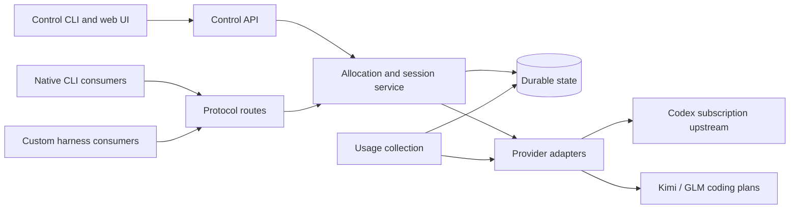

# Architecture

Status: proposed implementation; scope and session requirements are settled.

## Recommendation

Build an independent Rust service, `poolpartyd`, using Tokio and Axum. Use reqwest
with rustls for ordinary upstream HTTP; choose the WebSocket transport after the
Codex compatibility gates. The [DD review](dd-review.md) recommends HTTP/SSE first
because native WebSocket fallback can replay an uncertain request. Do not assume
a generic relay preserves every Codex transport behavior. Axum supplies the HTTP
routing and streaming application shell
([crate documentation](https://docs.rs/axum/latest/axum/)).

Build a small TypeScript/React/Vite dashboard into static assets served by the
daemon. Node is a build dependency, not a production service. A separate Rust
`poolparty` client should consume the same control API; curl examples can precede
it. Keep selection and credential policy on the server.

Rust fits the existing engineering expertise and makes cancellation, bounded
streaming, and shared state ownership explicit. This is not a claim that Python
cannot serve the workload. Extending a complete existing proxy would be faster
for a Codex-only dashboard; Poolparty needs a different provider boundary and a
strict session policy across all protocols.

## Ownership

Protocol requests and control operations invoke the same allocation service.
Poolparty does not spawn task workers, run user tools, own repositories, or manage
the caller's transcript. It is not an agent harness.

Start with focused modules in the daemon, plus a small shared API crate when the
CLI needs it. Candidate modules: `accounts`, `allocation`, `sessions`, `usage`,
`providers`, `proxy`, `auth`, `storage`. Avoid scaffolding many empty crates before
their boundaries have consumers. HTTP handlers translate protocol requests;
domain code owns policy; provider adapters own upstream-specific behavior.

## State and concurrency

Start with SQLite WAL on one persistent volume and exactly one active daemon.
Persist account metadata, session bindings, admission records, observations, and
audit events. Never hold a transaction or global lock across an upstream network
request. Atomically establish the binding and capacity claim before dispatch.

Session bindings are durable records. Active request claims have deadlines and
idempotent settlement. Idle sessions keep bindings while releasing concurrency.
After a crash, expired claims need conservative reconciliation: the provider may
have continued computing even though the daemon disappeared. No automatic replay
is justified by losing local request state.

Represent the provider quota owner separately from a credential handle. Multiple
keys or refreshed credentials for the same account cannot multiply its capacity.
Serialize refresh per upstream account and atomically replace its token generation.

This initial topology accepts restart downtime. A second active replica requires
shared transactional admission, refresh coordination, fencing, and a reviewed
database migration, likely to PostgreSQL. Sharing a SQLite file across pods is
not the scaling plan.

## Data path

Proxy native protocol bodies and event streams. Inspect only what is needed for
routing, admission, accounting, and security. Preserve tool calls, opaque reasoning
content, continuation tokens, cache directives, and extension fields. Explicit
model aliases may rewrite the model field; report their concrete resolution.

Separate client authentication headers from upstream credentials. Strip client
secrets before forwarding, attach only the chosen adapter's credentials, reject
arbitrary upstream URLs, and prevent credentials following cross-origin redirects.
Use bounded buffers, streaming parsers for telemetry, cancellation propagation,
and configurable request limits. Do not buffer an entire stream for the dashboard.

Same-protocol routing is the initial target. Responses, Chat Completions, and
Messages are distinct contracts. Cross-protocol translation is deferred and must
never be advertised as lossless by default.

## Relationship to codex-lb

Use [codex-lb as a reference](../research/codex-lb.md), not an initial fork or a
second allocator behind Poolparty. The [egress spike](../research/egress-reuse-spike.md)
found no typed public transport API at the pinned revision. Own a narrow interface
receiving one concrete account/attempt, and selectively adapt transport code only
after a demonstrated compatibility benefit. Preserve Poolparty's cancellation and
no-rebinding rules. No upstream code is included yet.
