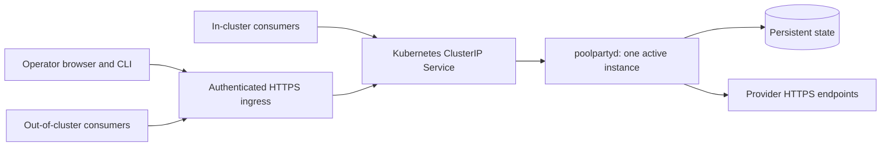

# Deployment and access

Status: proposed deployment contract, not a deployed service.

## Public application and private overlay

The public repository owns the daemon, client, UI, configuration schema, container
recipe, generic deployment examples, and public operating documentation. A
separate private infrastructure repository owns the actual installation.

| Public project | Private deployment overlay |
| --- | --- |
| Image build inputs and released artifacts | Exact deployed image digest and registry location |
| Generic Service, workload, and storage requirements | Namespace, storage class, volume sizing, node placement |
| Auth configuration schema and synthetic examples | Real issuer, audiences, client registrations, groups, grants |
| Secret interface and rotation contract | Vault references, bootstrap chain, SecretStores, ExternalSecrets |
| Generic HTTPS and streaming requirements | DNS, certificates, ingress classes, network policies, private routing |
| Consumer integration contracts | Actual consumer configuration, identities, account/pool mappings |
| Build and verification commands | Cluster build jobs, capacity, credentials, deployment automation |

Use a private Pulumi TypeScript overlay as the initial operator implementation.
Public consumers should not need that overlay or its infrastructure. Its converge
entrypoint should resolve operator inputs at runtime, validate the target context,
require immutable image digests, support a read-only preview, and keep secret
values out of command output. Even references-only configuration can reveal
private identities and therefore belongs in the overlay when estate-specific.

Build/verification infrastructure has its own lifecycle; replacing the runtime
stack should not destroy the build plane. The overlay consumes a verified commit
and image digest. It does not maintain a fork of the public application source.

## Network topology

Cluster callers use service discovery, for example
`http://poolparty.poolparty.svc.cluster.local:8080`. This is synthetic; the overlay
owns the real name. [Kubernetes Services](https://kubernetes.io/docs/concepts/services-networking/service/)
provide a stable frontend to workload endpoints. Workstation clients use a normal
HTTPS hostname such as `https://poolparty.example.com`, without local tunnels or
expecting cluster DNS to resolve outside the cluster.

HTTPS ingress can be reachable through the operator's existing private network
or through an explicitly configured public edge. A public source repository does
not require an unauthenticated or Internet-public service. Pick reachability in
the overlay; keep authentication at the application boundary in either case.

Expose the web UI and `/api/v1` control routes through ingress for diagnosis and
operation. Exposing inference routes to authorized remote clients is useful too,
but can be a separate ingress policy. Health endpoints reveal only minimal
health, and metrics stay restricted. A diagnostic route is not an auth bypass.

Require WebSocket upgrades, SSE without proxy buffering, appropriate streaming
idle timeouts, bounded request sizes, and no automatic inference retries at the
ingress. Validate these end to end, not just with a health GET. Internal traffic
uses the same authorization checks. Plain internal HTTP is a deployment choice
only within an explicitly trusted network; otherwise terminate TLS in the daemon
or use the estate's encrypted service transport.

## Human and machine authentication

Reuse the existing resource-server pattern conceptually: explicit issuer and
audience, allowed signature algorithms, bounded JWKS caching and key-rotation
refresh, expiration/not-before validation, and role/scope enforcement. Implement
with a maintained Rust OIDC/JWT library rather than copying a private consumer's
verifier. Use stable `(issuer, subject)` identity; email is a display attribute.

Proposed human flow: browser OIDC authorization code with PKCE, server-side session,
secure HttpOnly cookies, state/nonce checks, and CSRF protection for mutations.
The CLI uses its own public-client registration and PKCE loopback login, or device
authorization if the identity provider supports it. Real redirect registrations
belong to the private overlay.

Proposed machine flow: a distinct consumer grant using short-lived service tokens
where supported, or a scoped rotatable Poolparty bearer for clients limited to
API-key authentication. Separate read/usage, allocate/infer, and administrative
authority. Bind grants to authorized pools; a client-supplied account reference
does not expand access. Internal and external hostnames should validate against
one configured resource audience rather than constructing audiences from Host.

Provider OAuth and Poolparty access tokens serve different purposes. Do not forward
an operator's identity-provider token upstream. Do not accept an upstream token
as a Poolparty control grant. OIDC-enabled MCP configuration from other services
is a useful auth reference, but inference clients do not automatically implement
MCP OAuth. MCP is not required for Poolparty's initial API.

## State, secrets, and lifecycle

Initial workload: one Recreate Deployment and a single-writer persistent volume.
Avoid overlapping old/new allocators during replacement. Readiness requires
successful migrations and usable state; one exhausted provider must not make the
whole daemon unready. Liveness checks process health, not provider availability.
Shutdown stops admission and drains bounded active streams before termination.

Use a non-root container and explicit writable state paths. Mount credentials or
resolve secret handles at runtime. If mounted secret files need staging, copy
only those files with restricted ownership and permissions. Never recursively
change permissions across all persistent state at startup. Record a runtime-input
generation and define whether each configuration/credential change reloads safely
or requires an approved rollout; do not silently keep an obsolete staged copy.

The private overlay may materialize secrets through External Secrets and the
operator's vault. Poolparty must not require that specific secret backend. Durable
rotating credentials need a defined writable owner; a read-only mounted bootstrap
secret alone is insufficient to persist a refreshed token generation.

Backups cover bindings, retired-session markers, account metadata, credential
state, and schema version. Keep encryption key recovery separate from data backup.
Restoration must not create a second live refresh owner. Do not claim an old
credential backup is guaranteed usable after rotation; expose reauthentication
when necessary.

## Operational validation

Before activation, verify both authenticated Service and HTTPS paths, reject wrong
audiences and out-of-pool access, prove streaming and cancellation, and confirm a
restart preserves session bindings. Verify remote CLI login and usage queries from
an ordinary workstation network path. Activation and mutation of named shared
services remain explicit deployment actions after the design phase.
